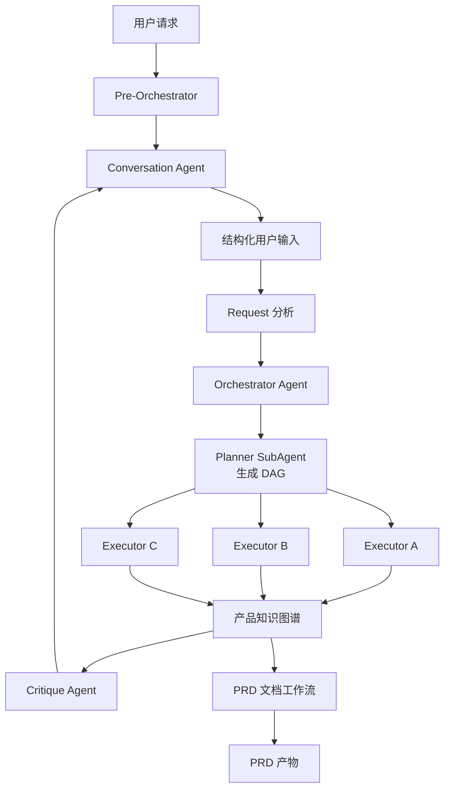

<div align="center">


# Meta PM Agent

[English](README.md) | [简体中文](README-zh.md)

**从产品想法，到结构化需求、多 Agent 并行执行、产品知识图谱与 PRD 产物。**

`meta-pm-agent` 是仓库名；工作区界面品牌为「问渠」。

[](https://github.com/MetaBrain-Labs/meta-pm-agent/releases)
[](LICENSE)
[](https://github.com/MetaBrain-Labs/meta-pm-agent/actions/workflows/ci.yml)
[](https://nodejs.org)

**[快速开始](#快速开始)** · **[界面截图](#界面截图)** · **[工作原理](#工作原理)** · **[合成示例](examples/local-preview.md)**

</div>


<sub>品牌主视觉。图中的流程示意与文档大纲仅用于表达产品方向；真实界面见[界面截图](#界面截图)，真实 Agent 拓扑见[工作原理](#工作原理)。</sub>

> **v0.1 本地预览版：** 单用户、同机运行、仅回环地址、仅支持 PRD。不支持云端同步/部署、附件、团队协作、MRD/BRD 或人工审批工作流。详见 [v0.1 边界](#v01-边界)与[已知限制](KNOWN_LIMITATIONS.md)。

## 界面截图

以下是在运行中的本地预览实例上、使用合成需求（"企业 Markdown 文档协同工具"）拍摄的真实截图。模糊区域由维护者自行打码；拍摄范围与遗留待办见[界面截图说明](assets/screenshots/README.md)。

### Planner DAG 与并行 Executor


<sub>产品主图把一次请求展开为 DAG：Orchestrator → Planner SubAgent → 依赖感知的并行 Executor → Critique。每个 Executor 的结果、工具调用、token 用量与费用都挂在对应 Agent 下。<em>流程示意截图，已打码，非生产数据。</em></sub>

### 产品知识图谱


<sub>单个工作区持久化 134 个节点、161 条关系，支持节点详情、关系类型、来源与生命周期状态；由共享的 AntV G6 视图渲染。</sub>

### 带证据复核的 PRD 生成


<sub>每轮 PRD 都会经过起草、一致性检查与三个独立评审打分；评分差超过 8 分直接驳回，可信草稿需要 85/100。未解决的证据问题会变成阻断项，而不是被编造补充。</sub>

<details>
<summary><strong>完整知识图谱导出</strong>（750 × 5592）</summary>

<br>


</details>

## 核心能力

- **对话 → 结构化需求 → 并行执行 → PRD。** 意图感知路由、在规划前补齐缺口的 Request 分析、依赖感知 DAG，以及全部 Executor 完成后的 Critique 复核。
- **持久化产品知识图谱。** 结构化节点、关系、决策、风险、开放问题、任务/来源溯源与补充轮修正——不是自由文本聊天记忆。
- **可审计的 PRD。** 章节起草、跨章节一致性检查、三个独立评审、有界重试、保留全部草稿历史、产物预览与 Markdown 下载。
- **可恢复执行。** PostgreSQL checkpoint、表单式人工介入恢复、已完成任务回放与服务端取消。

本文档其余部分是工程细节：架构、环境准备、数据库、API 与故障排查。

## 工作原理



产品主图使用固定骨架：

```text
parse_user_input
  -> request_agent
  -> orchestrator_agent
  -> planner_agent
  -> executor_router
  -> executor-* -> executor_aggregator -> executor_router
  -> orchestrator_agent (Critique)
  -> END
```

Planner SubAgent 在 Orchestrator 内生成 DAG；图中的 `planner_agent` 节点负责展示或恢复计划。所有 Executor 任务完成后，由 Orchestrator 调用 Critique。PRD 生成和 Question Form HITL 分别使用独立 LangGraph。

| 环节 | 运行内容 |
| --- | --- |
| 意图与需求 | Pre-Orchestrator、Conversation Agent、Request 分析 |
| 规划与执行 | Orchestrator、Planner SubAgent、10 个 Executor 领域、Critique |
| 持久化状态 | PostgreSQL checkpoint，以及每个工作区一行结构化图谱 |
| 交付物 | PRD 文档工作流（起草 → 一致性检查 → 评分 → 导出） |

模块边界、运行时状态、持久化流程和详细图示见 [STRUCTURE.md](STRUCTURE.md)。

## 技术栈

| 层 | 技术 |
| --- | --- |
| Agent 运行时 | TypeScript、LangGraph、LangChain、DeepAgents |
| API | Hono、Server-Sent Events |
| Web | React 19、Vite 6、Ant Design 6、Tailwind CSS 4、AntV G6 |
| 数据库 | PostgreSQL、Prisma、LangGraph PostgresSaver |
| 搜索 | 配置 Tavily 时使用 Tavily，否则降级到公开索引 |
| Monorepo | pnpm 11.3.0、Turborepo |

## 快速开始

### 环境要求

- Node.js >=22.13
- pnpm 11.3.0
- PostgreSQL
- DeepSeek 兼容的外部模型 API；v0.1 默认模型 ID 为 `deepseek-flash`

如尚未启用 pnpm，可使用 Corepack：

```bash
corepack enable
pnpm --version
```

输出的 pnpm 版本应为 `11.3.0`。

### 1. 安装

```bash
git clone https://github.com/MetaBrain-Labs/meta-pm-agent.git
cd meta-pm-agent
pnpm install
```

### 2. 配置

macOS/Linux：

```bash
cp .env.example .env
```

PowerShell：

```powershell
Copy-Item .env.example .env
```

至少填写以下变量：

| 变量 | 用途 |
| --- | --- |
| `POSTGRES_HOST`、`POSTGRES_PORT`、`POSTGRES_USER`、`POSTGRES_PASSWORD`、`POSTGRES_DB` | PostgreSQL 连接；也支持 `DATABASE_URL` |
| `OPENAI_API_KEY` | 模型服务密钥 |
| `TAVILY_API_KEY` | 可选 Tavily 搜索；缺省时使用公开索引 |
| `LANGGRAPH_CHECKPOINT_DATABASE_URL` | 可选独立 checkpoint 数据库地址 |

Chat 与 Document 的模型 ID、服务 Base URL、推理参数和计价统一在"本地设置"的模型使用列表中配置。内置费用使用 DeepSeek [当前高峰价估算快照](https://api-docs.deepseek.com/zh-cn/quick_start/pricing/)（缓存命中 ¥0.04/M、未命中 ¥2/M、输出 ¥8/M），实际账单以服务商为准。根据 [V4.1 Flash 迁移公告](https://api-docs.deepseek.com/zh-cn/news/news260910/)，旧 `deepseek-v4-flash`、`deepseek-v4-pro` 配置会在读取或升级时归一化为 `deepseek-flash`。

不得提交 `.env` 或 `resources/product-contexts/` 下的运行时产物。

### 3. 初始化数据库

首次安装请使用**空的开发数据库**：

```bash
pnpm --filter @repo/database db:generate
pnpm --filter @repo/database db:init
```

`db:init` 先执行 Prisma `db:push`，再安装受版本管理的模型列表、token 用量、PRD 和上下文快照表。支持 `public` schema；不要对生产数据库直接运行初始化命令。

#### 数据库结构说明

已有数据库先备份，再执行 `pnpm --filter @repo/database db:upgrade`。该命令增量添加本地软删除字段和缺失运行时表、归一化旧 DeepSeek 模型 ID，并更新 token/PRD 约束、`message.type` 和历史图谱默认值。它不会删除本地文件或业务数据；可重复执行，结构冲突会报错而不会自动覆盖。

SQL 位于 `packages/database/sql/20260914_runtime_tables.sql`。LangGraph checkpoint 表由 PostgresSaver 独立初始化。

### 4. 构建

```bash
pnpm build
```

共享包从 `dist/` 导出，因此开始应用开发前至少需要完整构建一次。

### 5. 运行

启动 v0.1 所需的 Web 和 API：

```bash
pnpm dev
```

也可以分别启动：

| 服务 | 地址 | 命令 |
| --- | --- | --- |
| Web | <http://localhost:3000> | `pnpm --filter web dev` |
| API | <http://localhost:3001> | `pnpm --filter @repo/api dev` |

Vite 会把 `/api` 代理到 `3001` 端口。

## 配置说明

- 产品上下文从所选工作区的概述文档、`resources/product-contexts/`、可选 context-snapshot 表和持久化工作区图谱恢复。
- Conversation Agent 仅在用户启用时获得 `web_search`；需要外部证据的 Executor 由 runtime 策略注入搜索。
- 配置 `TAVILY_API_KEY` 时使用 Tavily；未配置时使用支持的公开索引，并以结构化错误返回搜索失败，不中断 SSE。
- `LANGGRAPH_CHECKPOINT_DATABASE_URL` 可为工作流 checkpoint 覆盖 `DATABASE_URL`；两者均不可用时降级为内存 checkpoint。
- Agent 运行摘要是调试产物，由 `.env.example` 中的 `AGENT_SUMMARY_*` 变量控制。

## API

| 方法 | 路径 | 用途 |
| --- | --- | --- |
| `GET` | `/api/health` | 健康检查 |
| `GET/POST` | `/api/workspaces` | 查询或创建工作区 |
| `PATCH/DELETE` | `/api/workspaces/:id` | 重命名/修改路径或软移除工作区 |
| `GET/POST` | `/api/chats` | 查询或创建聊天 |
| `PATCH/DELETE` | `/api/chats/:id` | 重命名或软删除聊天 |
| `GET` | `/api/chats/:id/messages` | 恢复消息和工作流状态 |
| `POST` | `/api/chat` | 通过 SSE 运行聊天/产品工作流 |
| `POST` | `/api/chat/stop` | 中止服务端聊天 runtime |
| `GET` | `/api/workspaces/:workspaceId/knowledge-graph` | 读取当前知识图谱 |
| `POST` | `/api/workspaces/:workspaceId/document-generation` | 启动文档任务 |
| `GET` | `/api/workspaces/:workspaceId/document-generation/latest` | 读取最新任务/产物 |
| `GET` | `/api/document-generation/:runId` | 读取指定文档任务 |
| `POST` | `/api/document-generation/:runId/stop` | 停止文档任务 |

`POST /api/chat` 先发送 `start`，随后流式发送 Agent、工具、表单和 token 等类型化事件，最后以 `data: [DONE]` 结束。前端必须先调用 `/api/chat/stop`，再 abort fetch，才能让模型请求收到服务端 `AbortSignal`。

## 仓库结构

```text
apps/
  agent-runtime/  LangGraph/DeepAgents 运行时与测试
  api/            Hono API、SSE、持久化、文档任务
  web/            React/Vite 前端
  worker/         实验性 BullMQ 骨架；不属于 v0.1 运行链路
packages/
  shared/         Zod schema、DTO、事件、运行时契约
  database/       Prisma schema 与 Client
references/
  executor/       Executor profile、prompt 与 skill
resources/
  product-contexts/  生成的运行时快照
```

仓库工程规则见 [AGENTS.md](AGENTS.md)，中文版本见 [AGENTS-zh.md](AGENTS-zh.md)。

## 开发命令

| 命令 | 用途 |
| --- | --- |
| `pnpm build` | 通过 Turbo 构建全部包和应用 |
| `pnpm dev` | 启动 v0.1 的 Web 和 API |
| `pnpm --filter @repo/agent-runtime test` | 运行 Agent Runtime 测试 |
| `pnpm --filter @repo/api test` | 运行 API 测试 |
| `pnpm --filter web build` | 类型检查并构建前端 |
| `pnpm --filter @repo/database db:generate` | 生成 Prisma Client |
| `pnpm --filter @repo/database db:push` | 把 Prisma schema 同步到数据库 |
| `pnpm --filter @repo/database db:migrate` | 创建/执行开发 migration |

根目录 Turbo `lint`/`typecheck` 目前覆盖有限；请使用上表中的定向测试和构建。

## 构建问题与解决方案

本节整理自仓库原有的 `SOLUTIONS.md` 构建说明。

### 常见现象

首次构建、恢复 Turbo 缓存或只清理了部分构建产物后，可能出现：

- `TS2307: Cannot find module '@repo/shared'` 或 `@repo/database`；
- `TS7006`、`TS2339`、`TS2322`、`TS2345`、`TS18046`、`TS18047`、`TS6305`；
- `tsc` 成功退出，但没有生成 `dist/`；
- Turbo 提示 `no output files found`；
- 下游 API 代码中的 Prisma 类型退化成 `any`。

### 快速恢复

先重新生成 Prisma Client：

```bash
pnpm --filter @repo/database db:generate
```

然后只删除仓库内的 TypeScript 构建 metadata。

macOS/Linux：

```bash
find apps packages -path '*/node_modules' -prune -o -name tsconfig.tsbuildinfo -type f -delete
```

PowerShell：

```powershell
Get-ChildItem apps,packages -Recurse -File -Filter tsconfig.tsbuildinfo |
  Where-Object { $_.FullName -notmatch '\\node_modules\\' } |
  Remove-Item -Force
```

最后强制完整构建：

```bash
pnpm build --force
```

### 原因

1. **过期 `tsconfig.tsbuildinfo`** 可能仍把项目标记为最新，即使被忽略的 `dist/` 已不存在。Turbo 随后可能回放 cache hit，而 TypeScript 不产生输出。
2. **未生成 Prisma Client** 会导致 `.prisma/client` 声明缺失；在 `skipLibCheck: true` 下，问题可能延迟表现为 `any`、implicit-`any` 或看似无关的 repository 报错。
3. **消费者报错通常只是下游症状**。修改 API 类型前，先检查 `packages/shared/dist`、`packages/database/dist` 和 Prisma 生成声明。

### 数据库命令安全性

| 命令 | 作用 | 是否修改数据库数据/结构 |
| --- | --- | --- |
| `pnpm --filter @repo/database db:generate` | 根据 `schema.prisma` 生成 Prisma Client | 否 |
| `pnpm --filter @repo/database db:push` | 直接同步 schema | 是 |
| `pnpm --filter @repo/database db:migrate` | 创建/执行开发 migration | 是 |

若问题仍存在，请确认 `packages/shared/dist/index.d.ts`、`packages/database/dist/index.d.ts` 和 Prisma Client 生成文件存在，然后从第一条上游错误排查，不要先修复后续级联报错。

## 参与贡献

提交 Pull Request 前：

1. 阅读 [AGENTS.md](AGENTS.md) 和 [STRUCTURE.md](STRUCTURE.md)。
2. 所有面向 LLM 的 prompt 和 schema 指令文本必须使用英文。
3. 保持 package、SSE、持久化和 Agent 边界。
4. 先运行最小相关测试；涉及跨包契约时再运行 `pnpm build`。
5. 不得提交 `dist/`、`.env`、运行时快照或 Agent 摘要。

## v0.1 边界

这是单用户本地预览版，不提供账号界面、认证和租户隔离；固定本地所有者 ID 仅用于内部持久化。API 默认仅监听 `127.0.0.1:3001`；`HOST` 只接受回环地址，`CORS_ORIGINS` 只接受明确的本地 HTTP/HTTPS origin。前端使用 `http://localhost:3000` 或 `http://127.0.0.1:3000`；Vite 切换端口时同步修改配置。跨域限制不替代认证。

### 首次模型配置与本地运行边界

1. 在服务端 `.env` 中填写你自己的模型 API Key，重启 API；不要在浏览器输入或提交密钥。
2. 打开 Setting 的模型使用列表。当前 UI 只支持代码中列出的 DeepSeek 模型 ID，并非任意 OpenAI-compatible 模型选择器。
3. 新建自定义列表，选择通用或分类模式，检查 Chat 与 Document 的模型、Base URL、推理参数及计价；在聊天模型选择器中选用该列表。
4. 使用合成需求验证一次流程；确认服务商支持选定 ID。显示的价格是配置快照，模型费用由你承担，多 Agent 与 PRD 评分会产生多次调用。

模型服务会收到对话和相关产品上下文；搜索服务会收到查询文本。默认关闭的 LangSmith tracing 启用后可能上传 prompt、输出与执行记录。调试摘要及本地崩溃报告可能包含产品信息，分享前脱敏。首次发布移除了许可未确定的本地 tokenizer 资产，缺失用量不再通过该资产校正；以服务商用量和账单为准。

## 开源许可与发布资料

项目原创部分采用 [Apache License 2.0](LICENSE)，第三方内容保留原许可，详见 [第三方声明](THIRD_PARTY_NOTICES.md)。

- [贡献指南](CONTRIBUTING.md) 与 [安全报告](SECURITY.md)
- [完整合成示例](examples/local-preview.md) 与 [界面截图说明](assets/screenshots/README.md)
- [已知限制](KNOWN_LIMITATIONS.md)、[v0.1.0 发布说明](RELEASE_NOTES.md) 与 [发布检查表](RELEASE_CHECKLIST.md)
