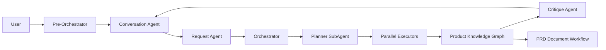

# meta-pm-agent

[English](README.md) | [简体中文](README-zh.md)

An AI-assisted product-management workspace that turns conversations into structured requirements, parallel execution plans, a persistent product knowledge graph, and PRD artifacts.

> This project is under active development. Review the [database schema note](#database-schema-note) before running the complete chat or document workflow.

## Highlights

- **Intent-aware conversation flow** — Pre-Orchestrator distinguishes casual chat, new products, project evolution, clarification, and interrupted-workflow continuation.
- **LangGraph product workflow** — Request analysis feeds an Orchestrator, Planner SubAgent, dependency-aware parallel Executors, and Critique quality gate.
- **Ten PM Executor domains** — Product strategy, market research, GTM, discovery, execution, marketing growth, analytics, AI shipping, toolkit, and interface craft.
- **Persistent product context** — Structured nodes, relations, decisions, risks, open questions, provenance, lifecycle state, and supplement-round correction.
- **Recoverable execution** — PostgreSQL checkpoints, form-based HITL resume, completed-task replay, and server-side cancellation.
- **Document generation** — A separate PRD workflow with section drafting, consistency checks, three-reviewer scoring, retries, artifact preview, and Markdown download.
- **Realtime frontend** — SSE reasoning and tool events, parallel-Agent status, token usage, Planner DAG progress, and a shared G6 knowledge-graph viewer.
- **Controlled tools** — Central allowlists, no arbitrary Agent filesystem access, optional Tavily/public-index search, and verifiable Evidence provenance.

## Architecture



The product graph uses this fixed skeleton:

```text
parse_user_input
  -> request_agent
  -> orchestrator_agent
  -> planner_agent
  -> executor_router
  -> executor-* -> executor_aggregator -> executor_router
  -> orchestrator_agent (Critique)
  -> END
```

Planner SubAgent generates the DAG inside Orchestrator. The `planner_agent` graph node displays or restores that plan. Critique runs from Orchestrator after all Executor tasks complete. PRD generation and Question Form HITL are separate LangGraphs.

See [STRUCTURE.md](STRUCTURE.md) for module ownership, runtime state, persistence flow, and detailed diagrams.

## Tech Stack

| Layer | Technology |
| --- | --- |
| Runtime | TypeScript, LangGraph, LangChain, DeepAgents |
| API | Hono, Server-Sent Events |
| Web | React 19, Vite 6, Ant Design 6, Tailwind CSS 4, AntV G6 |
| Database | PostgreSQL, Prisma, LangGraph PostgresSaver |
| Search | Tavily when configured; public-index fallback |
| Worker | BullMQ, Redis |
| Monorepo | pnpm 11.3.0, Turborepo |

## Quick Start

### Prerequisites

- Node.js 20+
- pnpm 11.3.0
- PostgreSQL
- Redis when running the worker or `pnpm dev`
- An OpenAI-compatible model API

Enable pnpm through Corepack if needed:

```bash
corepack enable
pnpm --version
```

The reported pnpm version should be `11.3.0`.

### 1. Install

```bash
git clone https://github.com/MetaBrain-Labs/meta-pm-agent.git
cd meta-pm-agent
pnpm install
```

### 2. Configure

macOS/Linux:

```bash
cp .env.example .env
```

PowerShell:

```powershell
Copy-Item .env.example .env
```

Edit `.env` with at least:

| Variable | Purpose |
| --- | --- |
| `POSTGRES_HOST`, `POSTGRES_PORT`, `POSTGRES_USER`, `POSTGRES_PASSWORD`, `POSTGRES_DB` | PostgreSQL connection; `DATABASE_URL` is also supported |
| `REDIS_HOST`, `REDIS_PORT` | BullMQ worker connection |
| `OPENAI_API_KEY` | Model-provider key |
| `TAVILY_API_KEY` | Optional Tavily search; public indexes are used when absent |
| `LANGGRAPH_CHECKPOINT_DATABASE_URL` | Optional separate checkpoint database URL |

Chat and Document model IDs, provider base URLs, reasoning parameters, and pricing are configured through Model Usage Profiles in Settings.

Do not commit `.env` or runtime output under `resources/product-contexts/`.

### 3. Initialize Prisma

```bash
pnpm --filter @repo/database db:generate
pnpm --filter @repo/database db:push
```

`db:generate` only generates Prisma Client. `db:push` changes the configured database.

#### Database schema note

The current Prisma schema covers the core application tables, but the API also uses raw SQL tables that are not yet represented by tracked Prisma migrations:

- `token_usage` — required by full chat/token persistence;
- `document_generation_run` and `document_artifact` — required by PRD generation;
- `product_context_snapshot` — optional; the runtime falls back to resource snapshots when absent.

Provision the required raw SQL tables before enabling those flows. LangGraph checkpoint tables are initialized automatically by `PostgresSaver` when a database URL is available. Tracking all remaining raw SQL tables as migrations is still an open repository setup task.

### 4. Build

```bash
pnpm build
```

Shared packages publish from `dist/`, so build at least once before starting application development.

### 5. Run

Start all services:

```bash
pnpm dev
```

Or start services separately:

| Service | URL | Command |
| --- | --- | --- |
| Web | <http://localhost:3000> | `pnpm --filter web dev` |
| API | <http://localhost:3001> | `pnpm --filter @repo/api dev` |
| Worker | Redis-backed | `pnpm --filter @repo/worker dev` |

The Vite server proxies `/api` to port `3001`.

## Configuration Notes

- Product context is restored from selected workspace overview files, `resources/product-contexts/`, the optional context-snapshot table, and the durable workspace graph.
- Conversation Agent receives `web_search` only when enabled by the user. Executors that require external evidence receive search through runtime policy.
- `TAVILY_API_KEY` enables Tavily. Without it, search uses supported public indexes and returns structured errors instead of terminating the SSE stream.
- `LANGGRAPH_CHECKPOINT_DATABASE_URL` overrides `DATABASE_URL` for workflow checkpoints. If neither is available, the runtime falls back to in-memory checkpoints.
- Agent run summaries are diagnostic output controlled by `AGENT_SUMMARY_*` variables in `.env.example`.

## API

| Method | Path | Purpose |
| --- | --- | --- |
| `GET` | `/api/health` | Health check |
| `GET` | `/api/account` | Load the local/default account |
| `GET/POST` | `/api/workspaces` | List or create workspaces |
| `GET/POST` | `/api/chats` | List or create chats |
| `GET` | `/api/chats/:id/messages` | Restore messages and workflow state |
| `POST` | `/api/chat` | Run a chat/product workflow over SSE |
| `POST` | `/api/chat/stop` | Abort the server-side chat runtime |
| `GET` | `/api/workspaces/:workspaceId/knowledge-graph` | Read the current graph |
| `POST` | `/api/workspaces/:workspaceId/document-generation` | Start a document run |
| `GET` | `/api/workspaces/:workspaceId/document-generation/latest` | Read the latest run/artifact |
| `GET` | `/api/document-generation/:runId` | Read one document run |
| `POST` | `/api/document-generation/:runId/stop` | Stop a document run |

`POST /api/chat` starts with a `start` event, streams typed Agent/tool/form/token events, and ends with `data: [DONE]`. The frontend calls `/api/chat/stop` before aborting its fetch so provider requests receive the server `AbortSignal`.

## Repository Layout

```text
apps/
  agent-runtime/  LangGraph/DeepAgents runtime and tests
  api/            Hono API, SSE, persistence, document jobs
  web/            React/Vite frontend
  worker/         BullMQ worker scaffold
packages/
  shared/         Zod schemas, DTOs, events, runtime contracts
  database/       Prisma schema and client
references/
  executor/       Executor profiles, prompts, and skills
resources/
  product-contexts/  Generated runtime snapshots
```

Repository engineering rules are in [AGENTS.md](AGENTS.md), with a Chinese version in [AGENTS-zh.md](AGENTS-zh.md).

## Development Commands

| Command | Purpose |
| --- | --- |
| `pnpm build` | Build packages and apps through Turbo |
| `pnpm dev` | Start all development services |
| `pnpm --filter @repo/agent-runtime test` | Run runtime tests |
| `pnpm --filter @repo/api test` | Run API tests |
| `pnpm --filter web build` | Type-check and build the frontend |
| `pnpm --filter @repo/database db:generate` | Generate Prisma Client |
| `pnpm --filter @repo/database db:push` | Synchronize the Prisma schema to the database |
| `pnpm --filter @repo/database db:migrate` | Create/apply a development migration |

Root `lint`/`typecheck` Turbo tasks currently provide limited coverage; use the focused tests and builds above.

## Troubleshooting: Build Issues and Solutions

This section consolidates the repository's previous `SOLUTIONS.md` build notes.

### Symptoms

A first build, a restored Turbo cache, or a partially cleaned workspace may report:

- `TS2307: Cannot find module '@repo/shared'` or `@repo/database`;
- `TS7006`, `TS2339`, `TS2322`, `TS2345`, `TS18046`, `TS18047`, or `TS6305`;
- a successful `tsc` process with missing `dist/` output;
- Turbo's `no output files found` warning;
- Prisma appearing as `any` in downstream API code.

### Fast recovery

First regenerate Prisma Client:

```bash
pnpm --filter @repo/database db:generate
```

Then remove only repository-local TypeScript build metadata.

macOS/Linux:

```bash
find apps packages -path '*/node_modules' -prune -o -name tsconfig.tsbuildinfo -type f -delete
```

PowerShell:

```powershell
Get-ChildItem apps,packages -Recurse -File -Filter tsconfig.tsbuildinfo |
  Where-Object { $_.FullName -notmatch '\\node_modules\\' } |
  Remove-Item -Force
```

Finally force a complete Turbo build:

```bash
pnpm build --force
```

### Why this works

1. **Stale `tsconfig.tsbuildinfo`** can say a project is current even when its ignored `dist/` directory is missing. Turbo may then replay a cache hit while TypeScript emits nothing.
2. **Missing Prisma Client generation** removes `.prisma/client` declarations. With `skipLibCheck: true`, the failure may surface later as `any`, implicit-`any`, or unrelated-looking repository errors.
3. **Consumer errors are often downstream symptoms.** Check `packages/shared/dist`, `packages/database/dist`, and generated Prisma declarations before editing API types.

### Database command safety

| Command | Effect | Changes database data/schema? |
| --- | --- | --- |
| `pnpm --filter @repo/database db:generate` | Generate Prisma Client from `schema.prisma` | No |
| `pnpm --filter @repo/database db:push` | Synchronize schema directly | Yes |
| `pnpm --filter @repo/database db:migrate` | Create/apply development migrations | Yes |

If the failure remains, verify that `packages/shared/dist/index.d.ts`, `packages/database/dist/index.d.ts`, and generated Prisma Client files exist, then review the first upstream error rather than the later cascade.

## Contributing

Before opening a pull request:

1. Read [AGENTS.md](AGENTS.md) and [STRUCTURE.md](STRUCTURE.md).
2. Keep all LLM-facing prompt and schema instruction prose in English.
3. Preserve package, SSE, persistence, and Agent boundaries.
4. Run the narrowest relevant tests, then `pnpm build` for cross-package changes.
5. Do not commit generated `dist/`, `.env`, runtime snapshots, or Agent summaries.
