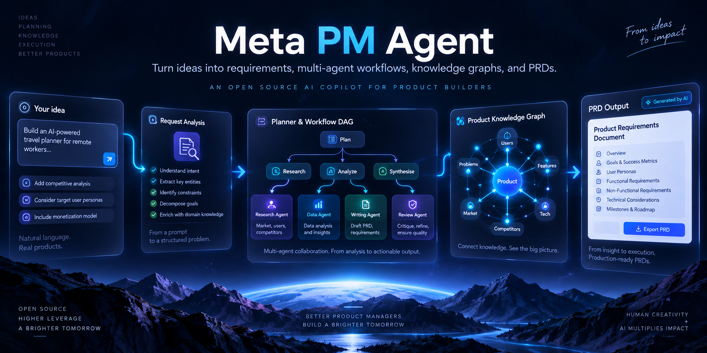
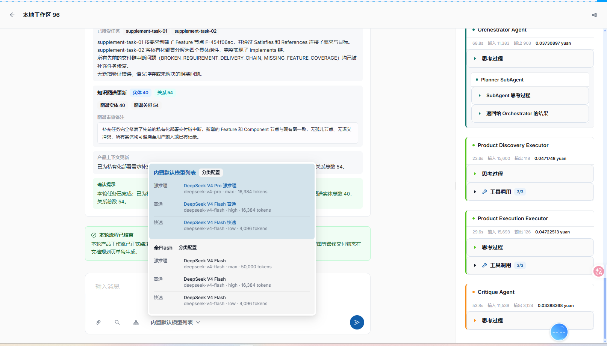
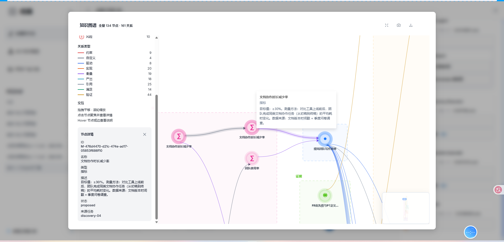
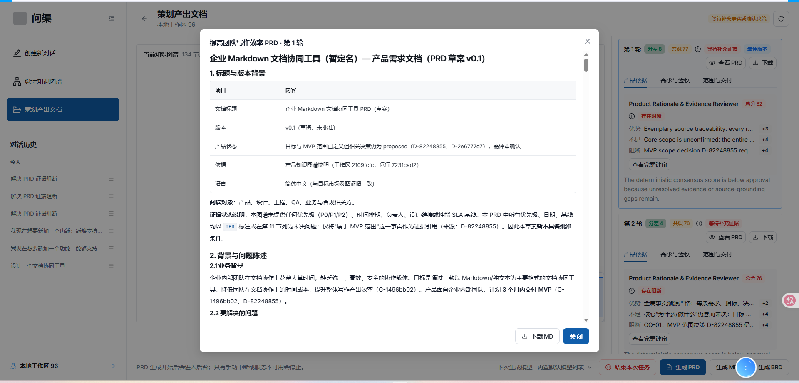
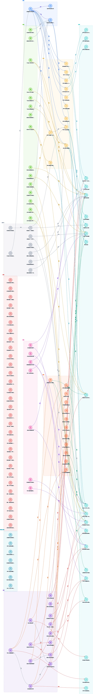
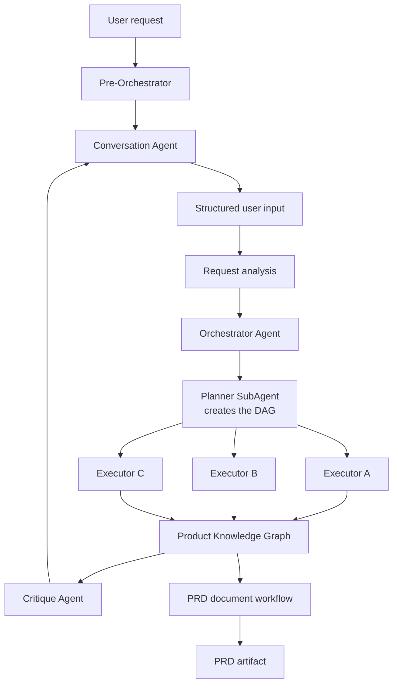

<div align="center">


# Meta PM Agent

[English](README.md) | [简体中文](README-zh.md)

**From product ideas to structured requirements, parallel agent execution, a persistent knowledge graph, and PRDs.**

`meta-pm-agent` is the repository name; the workspace UI is branded 问渠 in Chinese.

[](https://github.com/MetaBrain-Labs/meta-pm-agent/releases)
[](LICENSE)
[](https://github.com/MetaBrain-Labs/meta-pm-agent/actions/workflows/ci.yml)
[](https://nodejs.org)

**[Quick start](#quick-start)** · **[Screenshots](#screenshots)** · **[How it works](#how-it-works)** · **[Synthetic walkthrough](examples/local-preview.md)**

</div>



<sub>Brand illustration. The diagrams and the document outline shown above are illustrative; see [Screenshots](#screenshots) for the actual product UI and [How it works](#how-it-works) for the real agent topology.</sub>

> **v0.1 local preview:** single-user, same-machine, loopback-only, PRD only. No cloud sync or deployment, no attachments, no team collaboration, no MRD/BRD, no human approval workflow. See [v0.1 boundaries](#v01-boundaries) and [Known limitations](KNOWN_LIMITATIONS.md).

## Screenshots

Real captures of a running local preview, taken with synthetic requirements ("企业 Markdown 文档协同工具"). Masked regions were redacted by the maintainer; see [Screenshot notes](assets/screenshots/README.md) for scope and open items.

### Planner DAG and parallel Executors



<sub>The product graph turns one request into a DAG: Orchestrator → Planner SubAgent → dependency-aware parallel Executors → Critique. Executor results, tool calls, token usage, and cost stay attached to the owning Agent. <em>Illustrative workflow capture; masked and not production data.</em></sub>

### Product knowledge graph



<sub>134 nodes and 161 relations persisted for one workspace, with node details, relation types, provenance, and lifecycle status. Rendered by the shared AntV G6 viewer.</sub>

### PRD generation with evidence review



<sub>Each PRD round is drafted, cross-checked, and scored by three independent reviewers; a score spread over 8 rejects the attempt, and a reliable draft needs 85/100. Unresolved evidence surfaces as blockers instead of being invented.</sub>

<details>
<summary><strong>Full knowledge graph export</strong> (750 × 5592)</summary>

<br>



</details>

## What it does

- **Conversation → structured requirements → parallel execution → PRD.** Intent-aware routing, a Request analysis step that fills gaps before planning, a dependency-aware DAG, and a Critique pass after every Executor finishes.
- **A persistent product knowledge graph.** Structured nodes, relations, decisions, risks, open questions, task/source provenance, and supplement-round corrections — not free-form chat memory.
- **PRDs you can audit.** Section drafting, cross-section consistency checks, three independent reviewers, bounded retries, retained draft history, artifact preview, and Markdown download.
- **Recoverable by design.** PostgreSQL checkpoints, form-based human-in-the-loop resume, completed-task replay, and server-side cancellation.

The rest of this document is the engineering detail: architecture, setup, database, API, and troubleshooting.

## How it works



The product graph uses this fixed skeleton:

```text
parse_user_input
  -> request_agent
  -> orchestrator_agent
  -> planner_agent
  -> executor_router
  -> executor-* -> executor_aggregator -> executor_router
  -> orchestrator_agent (Critique)
  -> END
```

Planner SubAgent generates the DAG inside Orchestrator. The `planner_agent` graph node displays or restores that plan. Critique runs from Orchestrator after all Executor tasks complete. PRD generation and Question Form HITL are separate LangGraphs.

| Stage | What runs |
| --- | --- |
| Intent and requirements | Pre-Orchestrator, Conversation Agent, Request analysis |
| Planning and execution | Orchestrator, Planner SubAgent, 10 Executor domains, Critique |
| Durable state | PostgreSQL checkpoints and one structured graph row per workspace |
| Deliverable | PRD document workflow (draft → cross-check → score → export) |

See [STRUCTURE.md](STRUCTURE.md) for module ownership, runtime state, persistence flow, and detailed diagrams.

## Tech Stack

| Layer | Technology |
| --- | --- |
| Runtime | TypeScript, LangGraph, LangChain, DeepAgents |
| API | Hono, Server-Sent Events |
| Web | React 19, Vite 6, Ant Design 6, Tailwind CSS 4, AntV G6 |
| Database | PostgreSQL, Prisma, LangGraph PostgresSaver |
| Search | Tavily when configured; public-index fallback |
| Monorepo | pnpm 11.3.0, Turborepo |

## Quick Start

### Prerequisites

- Node.js >=22.13
- pnpm 11.3.0
- PostgreSQL
- A DeepSeek-compatible external model API; the v0.1 default model ID is `deepseek-flash`

Enable pnpm through Corepack if needed:

```bash
corepack enable
pnpm --version
```

The reported pnpm version should be `11.3.0`.

### 1. Install

```bash
git clone https://github.com/MetaBrain-Labs/meta-pm-agent.git
cd meta-pm-agent
pnpm install
```

### 2. Configure

macOS/Linux:

```bash
cp .env.example .env
```

PowerShell:

```powershell
Copy-Item .env.example .env
```

Edit `.env` with at least:

| Variable | Purpose |
| --- | --- |
| `POSTGRES_HOST`, `POSTGRES_PORT`, `POSTGRES_USER`, `POSTGRES_PASSWORD`, `POSTGRES_DB` | PostgreSQL connection; `DATABASE_URL` is also supported |
| `OPENAI_API_KEY` | Model-provider key |
| `TAVILY_API_KEY` | Optional Tavily search; public indexes are used when absent |
| `LANGGRAPH_CHECKPOINT_DATABASE_URL` | Optional separate checkpoint database URL |

Chat and Document model IDs, provider base URLs, reasoning parameters, and pricing are configured through Model Usage Profiles in Local Settings. Built-in cost estimates use DeepSeek's [current high-peak pricing snapshot](https://api-docs.deepseek.com/zh-cn/quick_start/pricing/) (cache hit ¥0.04/M, cache miss ¥2/M, output ¥8/M); actual provider billing is authoritative. Following the [V4.1 Flash migration notice](https://api-docs.deepseek.com/zh-cn/news/news260910/), legacy `deepseek-v4-flash` and `deepseek-v4-pro` profile values are normalized to `deepseek-flash` during read/upgrade.

Do not commit `.env` or runtime output under `resources/product-contexts/`.

### 3. Initialize the database

Use an **empty development database** for a first installation:

```bash
pnpm --filter @repo/database db:generate
pnpm --filter @repo/database db:init
```

`db:init` runs Prisma `db:push`, then installs tracked model-profile, token-usage, PRD and context-snapshot tables. The supported schema is `public`. Do not initialize a production database with this command.

#### Database schema note

For an existing database, back it up first and run `pnpm --filter @repo/database db:upgrade`. This adds local soft-delete columns and missing runtime tables, normalizes legacy DeepSeek model IDs, updates cached-token/PRD constraints, widens `message.type`, and defaults the legacy graph `content` column. It never removes local files or business data. Upgrades are repeatable and conflicting schemas fail rather than being overwritten.

The SQL is tracked at `packages/database/sql/20260914_runtime_tables.sql`. PostgresSaver initializes its own checkpoint tables independently.

### 4. Build

```bash
pnpm build
```

Shared packages publish from `dist/`, so build at least once before starting application development.

### 5. Run

Start the v0.1 Web and API services:

```bash
pnpm dev
```

Or start services separately:

| Service | URL | Command |
| --- | --- | --- |
| Web | <http://localhost:3000> | `pnpm --filter web dev` |
| API | <http://localhost:3001> | `pnpm --filter @repo/api dev` |

The Vite server proxies `/api` to port `3001`.

## Configuration Notes

- Product context is restored from selected workspace overview files, `<localPath>/resources/product-contexts/<workspaceId>.json`, the optional context-snapshot table, and the durable workspace graph. A stale local snapshot cannot override newer archived database context.
- Generated PRDs are exported after database persistence to `<localPath>/resources/documents/<workspaceId>/prd/<artifactId>.md`, including artifacts awaiting additional evidence. Local export failure does not fail the document run or disable viewing/downloads.
- Project and document pages show current local storage paths and synchronization status. `GET /api/workspaces/:id/local-storage` checks current files; `POST /api/workspaces/:id/local-storage/sync` copies missing context and the latest PRD without overwriting different content. Synchronization is blocked while project tasks are running.
- Changing a local path copies this workspace's generated context and PRD history, preserves source files, and reports partial failures or conflicts. Old central snapshots are copied lazily and retired per workspace; `PRODUCT_CONTEXT_RESOURCE_DIR` only locates that legacy directory. Local context snapshots omit graph nodes and relations and require the database for full restoration.
- Generated directories receive a local `.gitignore` if one does not already exist; project-root Git settings and existing ignore files are preserved.
- Conversation Agent receives `web_search` only when enabled by the user. Executors that require external evidence receive search through runtime policy.
- `TAVILY_API_KEY` enables Tavily. Without it, search uses supported public indexes and returns structured errors instead of terminating the SSE stream.
- `LANGGRAPH_CHECKPOINT_DATABASE_URL` overrides `DATABASE_URL` for workflow checkpoints. If neither is available, the runtime falls back to in-memory checkpoints.
- Agent run summaries are diagnostic output controlled by `AGENT_SUMMARY_*` variables in `.env.example`.

## API

| Method | Path | Purpose |
| --- | --- | --- |
| `GET` | `/api/health` | Health check |
| `GET` | `/api/local-directories?path=<absolute-directory>` | Browse API-host folders; omit path to start at home |
| `GET/POST` | `/api/workspaces` | List or create workspaces |
| `PATCH/DELETE` | `/api/workspaces/:id` | Rename/relink or soft-remove a workspace |
| `GET/POST` | `/api/chats` | List or create chats |
| `PATCH/DELETE` | `/api/chats/:id` | Rename or soft-delete a chat |
| `GET` | `/api/chats/:id/messages` | Restore messages and workflow state |
| `POST` | `/api/chat` | Run a chat/product workflow over SSE |
| `POST` | `/api/chat/stop` | Abort the server-side chat runtime |
| `GET` | `/api/workspaces/:workspaceId/knowledge-graph` | Read the current graph |
| `POST` | `/api/workspaces/:workspaceId/document-generation` | Start a document run |
| `GET` | `/api/workspaces/:workspaceId/document-generation/latest` | Read the latest run/artifact |
| `GET` | `/api/document-generation/:runId` | Read one document run |
| `POST` | `/api/document-generation/:runId/stop` | Stop a document run |

`POST /api/chat` starts with a `start` event, streams typed Agent/tool/form/token events, and ends with `data: [DONE]`. The frontend calls `/api/chat/stop` before aborting its fetch so provider requests receive the server `AbortSignal`.

## Repository Layout

```text
apps/
  agent-runtime/  LangGraph/DeepAgents runtime and tests
  api/            Hono API, SSE, persistence, document jobs
  web/            React/Vite frontend
  worker/         Experimental BullMQ scaffold; excluded from the v0.1 run path
packages/
  shared/         Zod schemas, DTOs, events, runtime contracts
  database/       Prisma schema and client
references/
  executor/       Executor profiles, prompts, and skills
resources/
  product-contexts/  Generated runtime snapshots
```

Repository engineering rules are in [AGENTS.md](AGENTS.md), with a Chinese version in [AGENTS-zh.md](AGENTS-zh.md).

## Development Commands

| Command | Purpose |
| --- | --- |
| `pnpm build` | Build packages and apps through Turbo |
| `pnpm dev` | Start the v0.1 Web and API services |
| `pnpm --filter @repo/agent-runtime test` | Run runtime tests |
| `pnpm --filter @repo/api test` | Run API tests |
| `pnpm --filter web build` | Type-check and build the frontend |
| `pnpm --filter @repo/database db:generate` | Generate Prisma Client |
| `pnpm --filter @repo/database db:push` | Synchronize the Prisma schema to the database |
| `pnpm --filter @repo/database db:migrate` | Create/apply a development migration |

Root `lint`/`typecheck` Turbo tasks currently provide limited coverage; use the focused tests and builds above.

## Troubleshooting: Build Issues and Solutions

This section consolidates the repository's previous `SOLUTIONS.md` build notes.

### Symptoms

A first build, a restored Turbo cache, or a partially cleaned workspace may report:

- `TS2307: Cannot find module '@repo/shared'` or `@repo/database`;
- `TS7006`, `TS2339`, `TS2322`, `TS2345`, `TS18046`, `TS18047`, or `TS6305`;
- a successful `tsc` process with missing `dist/` output;
- Turbo's `no output files found` warning;
- Prisma appearing as `any` in downstream API code.

### Fast recovery

First regenerate Prisma Client:

```bash
pnpm --filter @repo/database db:generate
```

Then remove only repository-local TypeScript build metadata.

macOS/Linux:

```bash
find apps packages -path '*/node_modules' -prune -o -name tsconfig.tsbuildinfo -type f -delete
```

PowerShell:

```powershell
Get-ChildItem apps,packages -Recurse -File -Filter tsconfig.tsbuildinfo |
  Where-Object { $_.FullName -notmatch '\\node_modules\\' } |
  Remove-Item -Force
```

Finally force a complete Turbo build:

```bash
pnpm build --force
```

### Why this works

1. **Stale `tsconfig.tsbuildinfo`** can say a project is current even when its ignored `dist/` directory is missing. Turbo may then replay a cache hit while TypeScript emits nothing.
2. **Missing Prisma Client generation** removes `.prisma/client` declarations. With `skipLibCheck: true`, the failure may surface later as `any`, implicit-`any`, or unrelated-looking repository errors.
3. **Consumer errors are often downstream symptoms.** Check `packages/shared/dist`, `packages/database/dist`, and generated Prisma declarations before editing API types.

### Database command safety

| Command | Effect | Changes database data/schema? |
| --- | --- | --- |
| `pnpm --filter @repo/database db:generate` | Generate Prisma Client from `schema.prisma` | No |
| `pnpm --filter @repo/database db:push` | Synchronize schema directly | Yes |
| `pnpm --filter @repo/database db:migrate` | Create/apply development migrations | Yes |

If the failure remains, verify that `packages/shared/dist/index.d.ts`, `packages/database/dist/index.d.ts`, and generated Prisma Client files exist, then review the first upstream error rather than the later cascade.

## Contributing

Before opening a pull request:

1. Read [AGENTS.md](AGENTS.md) and [STRUCTURE.md](STRUCTURE.md).
2. Keep all LLM-facing prompt and schema instruction prose in English.
3. Preserve package, SSE, persistence, and Agent boundaries.
4. Run the narrowest relevant tests, then `pnpm build` for cross-package changes.
5. Do not commit generated `dist/`, `.env`, runtime snapshots, or Agent summaries.

## v0.1 boundaries

This is a single-user local preview with no account UI, authentication, or tenant isolation; a fixed local owner ID exists only inside persistence. The API binds to `127.0.0.1:3001` by default. `HOST` accepts loopback addresses only; `CORS_ORIGINS` accepts exact local HTTP/HTTPS origins only. Open the web app at `http://localhost:3000` or `http://127.0.0.1:3000`; update the origins if Vite changes ports. CORS does not replace authentication.

### First model setup and local deployment boundary

1. Set your own provider API key in server-side `.env` and restart the API. Never put credentials into browser forms or commits.
2. Open Model Usage Profiles in Settings. The current UI supports the DeepSeek IDs enumerated in the code; it is not a general-purpose OpenAI-compatible model selector.
3. Create a universal or tiered profile; check Chat and Document model IDs, base URLs, reasoning parameters and pricing, then select it in the chat model selector.
4. Try the synthetic example and confirm your provider supports the selected IDs. Prices displayed are configuration snapshots. You pay provider costs; parallel agents and PRD reviewers produce multiple calls.

Model providers receive conversations and relevant product context; search providers receive search queries. Enabling optional LangSmith tracing can upload prompts, outputs and traces. Debug summaries and local crash reports may contain product data; redact before sharing. This release removes tokenizer assets whose standalone license was not established, so usage omitted by providers is no longer corrected using those assets. Provider usage and invoices are authoritative.

## License and release resources

Project-authored material is licensed under the [Apache License 2.0](LICENSE). Third-party material retains its original terms; see [Third-party notices](THIRD_PARTY_NOTICES.md).

- [Contributing](CONTRIBUTING.md) and [Security reporting](SECURITY.md)
- [Complete synthetic example](examples/local-preview.md) and [Screenshot notes](assets/screenshots/README.md)
- [Known limitations](KNOWN_LIMITATIONS.md), [Release notes v0.1.0](RELEASE_NOTES.md) and [Release checklist](RELEASE_CHECKLIST.md)
