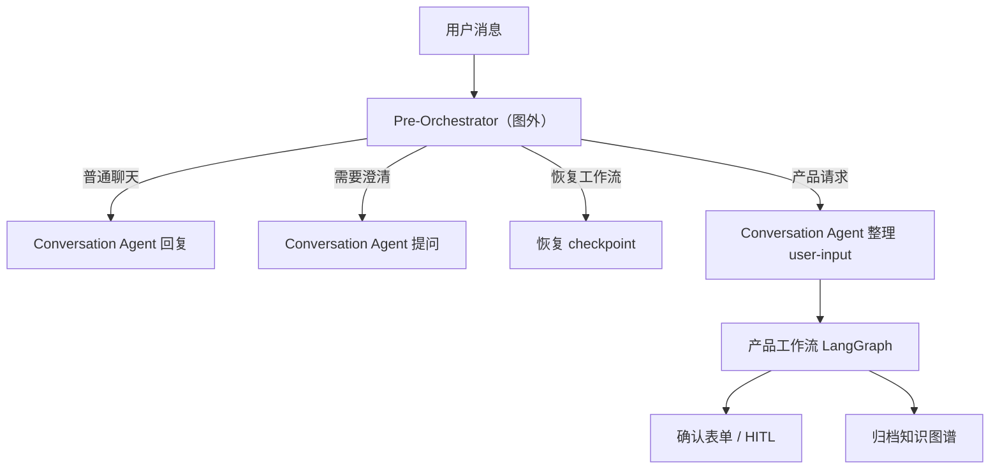
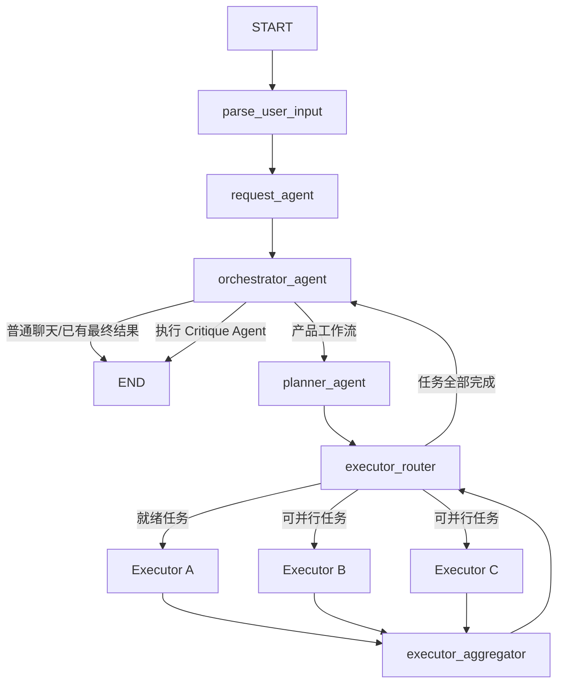
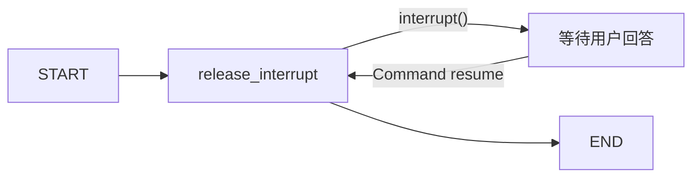
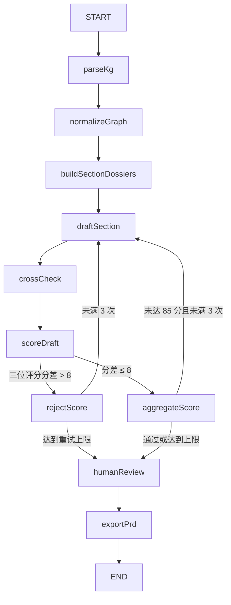

当前项目并不是“所有 Agent 都直接挂在一个 LangGraph 里”，而是三套图，加一层图外的 Conversation/Pre-Orchestrator 编排。

## 1. 总体入口



Pre-Orchestrator 和 Conversation Agent 当前主要在 LangGraph 外运行。Conversation Agent 生成 `<user-input>` 后，才调用产品主图：[conversation/stream.ts](<repository-path>

---

## 2. 产品主工作流

主图定义在 [workflow.ts](<repository-path>



各节点职责：

1. `parse_user_input`

   把 Conversation Agent 的 `<user-input>` 文本解析成结构化语句数组，不调用模型。

2. `request_agent`

   将结构化输入分析成业务模型、缺失信息和问题，并通过 custom stream 输出 Request Agent 的推理、Token 和分析结果：[request-node.ts](<repository-path>

3. `orchestrator_agent`

   负责顶层路由和生命周期管理：
   - 判断普通聊天、创建产品还是演进现有产品。
   - 调用内部 Planner SubAgent 生成 `TaskExecutionPlan` DAG。
   - 所有 Executor 完成后，再次进入该节点并执行 Critique Agent。
   - 更新知识图谱的 `initial/building/refining/stable` 状态。

4. `planner_agent`

   这个名称容易误解：**它目前不真正生成计划**。Planner SubAgent 已经在 Orchestrator 内生成 DAG，这个节点主要负责向前端回放计划和 checkpoint 中已有的 Executor 结果：[product-workflow-node.ts](<repository-path>

5. `executor_router`

   节点本身是空操作，真正调度逻辑位于条件边：
   - 找出依赖已经完成的任务。
   - 同一个 Executor 每批只选最早的一个任务。
   - 不同 Executor 可以同时执行。
   - 没有未完成任务时回到 `orchestrator_agent` 执行 Critique。
   - 如果 DAG 无可执行节点，也回到 Orchestrator，由后续检查处理。

   调度代码在 [product-workflow-node.ts](<repository-path>

6. 十个 Executor 节点

   每个领域一个固定 LangGraph 节点，例如产品策略、市场研究、产品发现、产品执行、AI Shipping 等。节点会：
   - 找到分配给自己的下一个就绪任务。
   - 读取紧凑知识图谱上下文。
   - 调用工具写入节点、关系、决策、风险和问题。
   - 返回 `ExecutorAgentResult` 和新的完整图谱快照。

7. `executor_aggregator`

   它主要是并行批次的 barrier，并把合并后的知识图谱事件发给上游。实际合并工作由 LangGraph State reducer 完成。

8. Critique Agent

   Critique 没有注册成独立 LangGraph 节点。所有任务完成后，Router 返回 `orchestrator_agent`，该节点检测计划已完成后直接调用 Critique Agent，生成：
   - 任务接受/重试结论
   - 知识图谱审查结果
   - 待用户确认的问题
   - 最终 `ProductWorkflowResult`

---

## 3. 共享状态与并行合并

状态定义在 [state.ts](<repository-path>

- `userInput`
- `requestAnalysis`
- `orchestratorDecision`
- `plan`
- `executorResults`
- `knowledgeGraph`
- `productWorkflow`
- `supplementAgentTypes`

并行 Executor 不直接覆盖彼此：

- `executorResults` 按 `task_id` 幂等合并。
- `knowledgeGraph` 通过专门的图谱快照 reducer 合并。
- 普通字段使用“新值覆盖旧值”的 reducer。
- 空数组和 `null` 在恢复场景中具有显式清理语义。

因此并行结构实际是：

```text
同一批 Executor 从同一图谱快照开始
    → 每个 Executor 生成自己的完整快照
    → LangGraph reducer 合并所有快照
    → Aggregator 发出合并后的图谱
```

---

## 4. 中断与恢复

主产品图使用稳定的 `thread_id`：

```text
workflow:{conversationId}:{requestFormId}
```

默认优先使用 PostgreSQL `PostgresSaver`；数据库不可用时降级为 `MemorySaver`：[workflow-checkpointer.ts](<repository-path>

恢复有两种方式：

- checkpoint 恢复：相同 `thread_id`，向 `stream()` 传入 `null`，从保存位置继续。
- 历史产物恢复：从聊天消息恢复 Request Analysis、Planner DAG、Executor 结果和知识图谱，再生成 supplement plan。

重跑某个任务时，会同时移除依赖它的下游任务结果，保留不受影响的 Executor 结果。

### HITL 的特殊之处

表单中断使用一套独立的轻量 LangGraph：



它只负责释放 `interrupt()` 和接收 `Command({ resume })`，不承载产品业务工作流：[human-in-the-loop.ts](<repository-path>

因此当前产品主图并没有在 Executor 或 Critique 节点中直接暂停；它先完成本轮，Conversation 层再把待确认问题包装成独立 HITL 表单。

---

## 5. PRD 文档工作流

文档生成是另一套独立 LangGraph，不属于产品主图：



关键规则：

- 三个独立评分 Agent。
- 最大允许分差：8。
- 质量阈值：85。
- 最多生成三版草稿。
- 最终选择规则会保留所有评分历史。
- `humanReview` 当前只是自动批准占位节点，没有真正调用 `interrupt()`。

定义见 [document-workflow.ts](<repository-path>

一句话概括：**Conversation 层决定何时进入图；产品主图负责“分析 → 规划 → 并行执行 → 审查”；文档图负责“读取知识图谱 → 写 PRD → 多评分重试 → 导出”；HITL 图只负责表单暂停和恢复。**
