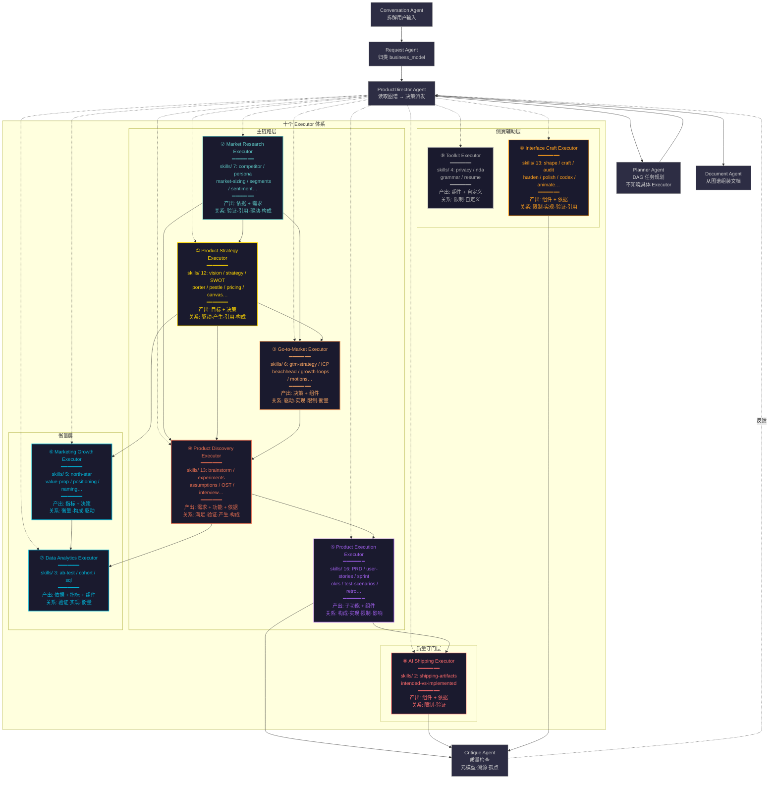

# Executor 体系全景



## 10 个 Executor 目录结构总览

```
pm-subagents/
├── executor_agent设计概览.md
├── 知识图谱设计.md
├── executor_体系全景.md
│
├── executor/
│   ├── product-strategy-executor/       # ①  12 skills  主链路·起点
│   ├── executor.json
│   ├── README.md
│   ├── prompts/{cn,en}.md
│   └── skills/{product-vision, product-strategy, business-model,
│         lean-canvas, startup-canvas, ansoff-matrix, swot-analysis,
│         porters-five-forces, pestle-analysis, value-proposition,
│         pricing-strategy, monetization-strategy}/
│
│   ├── market-research-executor/        # ②   7 skills  主链路
│   ├── executor.json
│   ├── README.md
│   ├── prompts/{cn,en}.md
│   └── skills/{competitor-analysis, user-personas, market-sizing,
│         market-segments, customer-journey-map, sentiment-analysis,
│         user-segmentation}/
│
│   ├── gtm-executor/                    # ③   6 skills  主链路·桥接
│   ├── executor.json
│   ├── README.md
│   ├── prompts/{cn,en}.md
│   └── skills/{gtm-strategy, beachhead-segment, ideal-customer-profile,
│         gtm-motions, growth-loops, competitive-battlecard}/
│
│   ├── product-discovery-executor/      # ④  13 skills  主链路
│   ├── executor.json
│   ├── README.md
│   ├── prompts/{cn,en}.md
│   └── skills/{brainstorm-ideas-{existing,new},
│         brainstorm-experiments-{existing,new},
│         identify-assumptions-{existing,new},
│         prioritize-assumptions, prioritize-features,
│         opportunity-solution-tree, interview-script,
│         summarize-interview, metrics-dashboard,
│         analyze-feature-requests}/
│
│   ├── product-execution-executor/      # ⑤  16 skills  主链路·拆细
│   ├── executor.json
│   ├── README.md
│   ├── prompts/{cn,en}.md
│   └── skills/{create-prd, user-stories, job-stories, wwas,
│         sprint-plan, brainstorm-okrs, outcome-roadmap,
│         prioritization-frameworks, test-scenarios,
│         strategy-red-team, pre-mortem, stakeholder-map,
│         summarize-meeting, release-notes, retro, dummy-dataset}/
│
│   ├── marketing-growth-executor/       # ⑥   5 skills  衡量层
│   │   ├── executor.json
│   │   ├── README.md
│   │   ├── prompts/{cn,en}.md
│   │   └── skills/{north-star-metric, value-prop-statements,
│   │         positioning-ideas, product-name, marketing-ideas}/
│   │
│   ├── data-analytics-executor/         # ⑦   3 skills  衡量层
│   │   ├── executor.json
│   │   ├── README.md
│   │   ├── prompts/{cn,en}.md
│   │   └── skills/{ab-test-analysis, cohort-analysis, sql-queries}/
│   │
│   ├── ai-shipping-executor/            # ⑧   2 skills  质量守门层
│   │   ├── executor.json
│   │   ├── README.md
│   │   ├── prompts/{cn,en}.md
│   │   └── skills/{shipping-artifacts, intended-vs-implemented}/
│   │
│   ├── toolkit-executor/                # ⑨   4 skills  侧翼辅助层
│   │   ├── executor.json
│   │   ├── README.md
│   │   ├── prompts/{cn,en}.md
│   │   └── skills/{privacy-policy, draft-nda, grammar-check, review-resume}/
│   │
│   └── interface-craft-executor/        # ⑩  13 skills  侧翼辅助层
│       ├── executor.json
│       ├── README.md
│       ├── prompts/{cn,en}.md
│       └── skills/{shape, layout, craft, bolder, quieter, animate,
│             delight, colorize, audit, harden, polish, critique, codex}/
│
├── tests/
│   └── test_executor_isolation.ps1     # 隔离性自动化回归测试（7 维检查）
│
├── research/                           # 系统提示词对比研究
│   ├── research_claude-fable-5.md
│   ├── research_agent_patterns.md
│   ├── research_default-styles.md
│   ├── research_improvement_points.md
│   ├── research_memory_system.md
│   └── research_reminders_and_safety.md
│
└── references/
    └── impeccable/                      # ⑩ 技能来源（v3.7.1）
```

## 依赖关系矩阵

| ↓ 下游 \ 上游 → | ① | ② | ③ | ④ | ⑤ | ⑥ | ⑦ | ⑧ | ⑨ | ⑩ |
|:---|---:|:---:|:---:|:---:|:---:|:---:|:---:|:---:|:---:|:---:|
| ① Strategy | — | — | — | — | — | — | — | — | — | — |
| ② Research | — | — | — | — | — | — | — | — | — | — |
| ③ GTM | ✓ | ✓ | — | — | — | — | — | — | — | — |
| ④ Discovery | ✓ | ✓ | ✓ | — | — | — | — | — | — | — |
| ⑤ Execution | ✓ | — | — | ✓ | — | — | — | — | — | — |
| ⑥ Marketing | ✓ | ✓ | — | — | — | — | — | — | — | — |
| ⑦ Analytics | — | — | — | ✓ | — | ✓ | — | — | — | — |
| ⑧ Shipping | — | — | — | — | ✓ | — | — | — | — | — |
| ⑨ Toolkit | — | — | — | — | — | — | — | — | — | — |
| ⑩ Interface | — | — | — | — | — | — | — | — | — | — |

> ⑨⑩ 不依赖其他 Executor，仅从图谱中读取已有节点进行操作。

## 系统提示词质量保障

| 维度 | 说明 |
|------|------|
| **隔离性** | 每 Executor 不引用、不比较、不依赖其他 Executor。`tests/test_executor_isolation.ps1` 自动验证 7 个维度 |
| **FORBIDDEN 禁止输出** | 每 Executor 含 5 类 `<execute>` 禁止内容 |
| **BAD EXAMPLE 错误对照** | 每 Executor 含 2 组 bad-example + WHY BAD 标注 |
| **NEVER/ONLY 锚点词** | 大写命令词提升关键约束的遵循度 |
| **技能描述表格化** | 从长篇描述压缩为表格 + 引用 SKILL.md |

优化依据详见 `research/research_improvement_points.md`。

## 知识图谱因果链 & Executor 分工

```
                        ① Strategy
                    创建 目标 ──产生──→ 决策
                          │              │
                    ② Research           │
                    创建 依据 ──引用──→   │
                    创建 需求 ──驱动──→   │
                          │              │
                    ③ GTM               │
                    细化 决策 + 组件 ←───┘
                          │
                    ④ Discovery
                    创建 功能 ──满足──→ 需求
                    创建 依据 ──验证──→ 功能/决策
                          │
                    ⑤ Execution
                    拆细 功能 ──构成──→ 子功能
                    创建 组件 ──实现──→ 功能
                          │
               ┌──────────┼──────────┐
               │          │          │
         ⑥ Marketing  ⑧ Shipping  ⑩ Interface
         创建 指标     补全 组件    审视 组件
         衡量 目标     验证 代码    注入 规范
               │          │          │
         ⑦ Analytics      │          │
         验证 指标/决策    │          │
         创建 查询组件     │          │
               │          │          │
               └──────────┼──────────┘
                          │
                    ⑨ Toolkit
                  (超链外辅助)

      ⑧⑩ 产出 依据 ──→ Critique Agent ──反馈──→ ProductDirector
```
